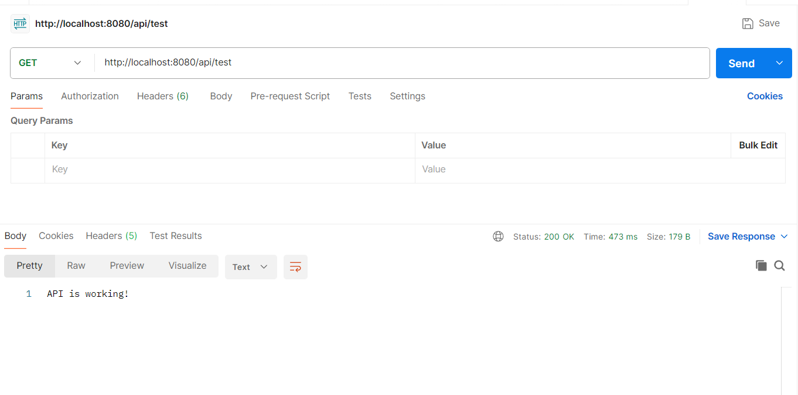
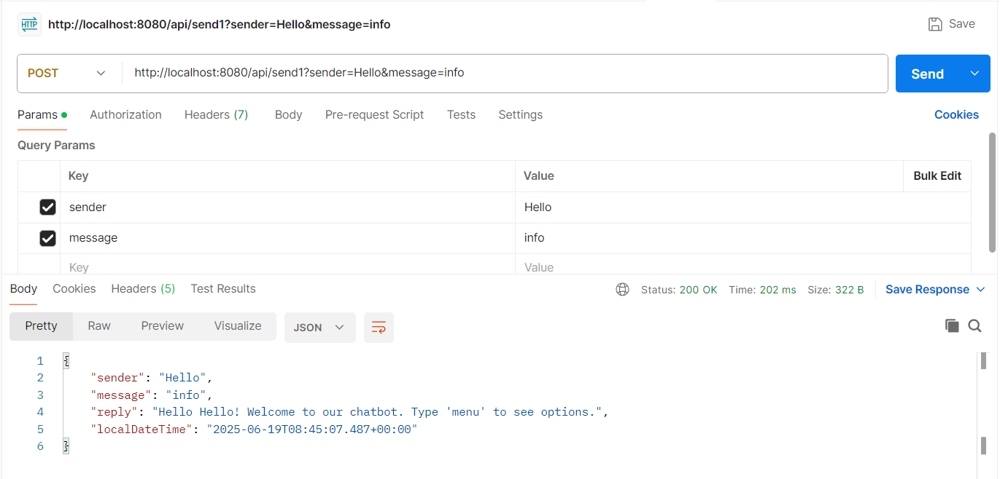
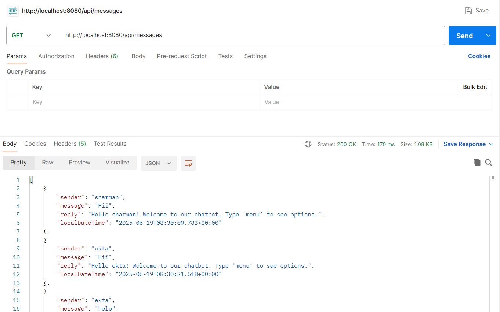
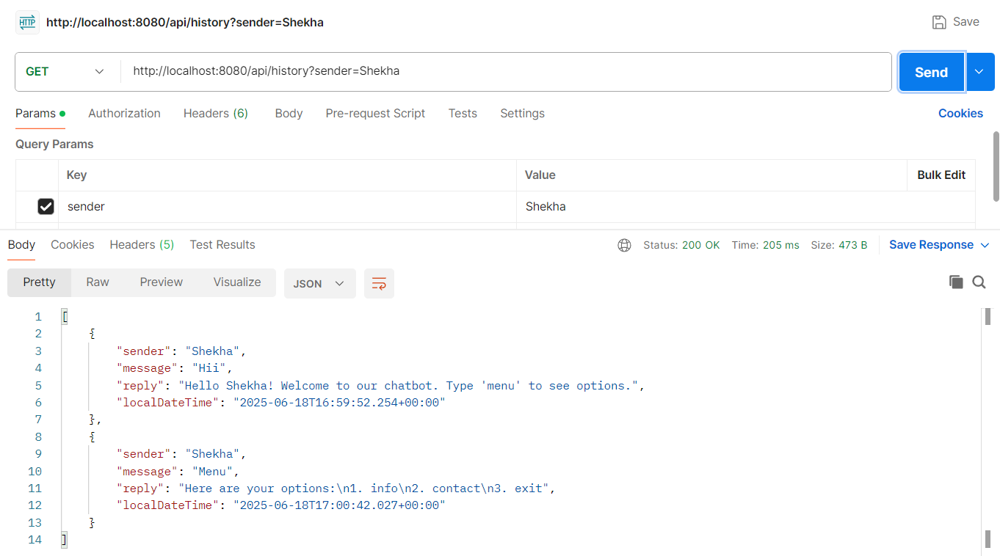
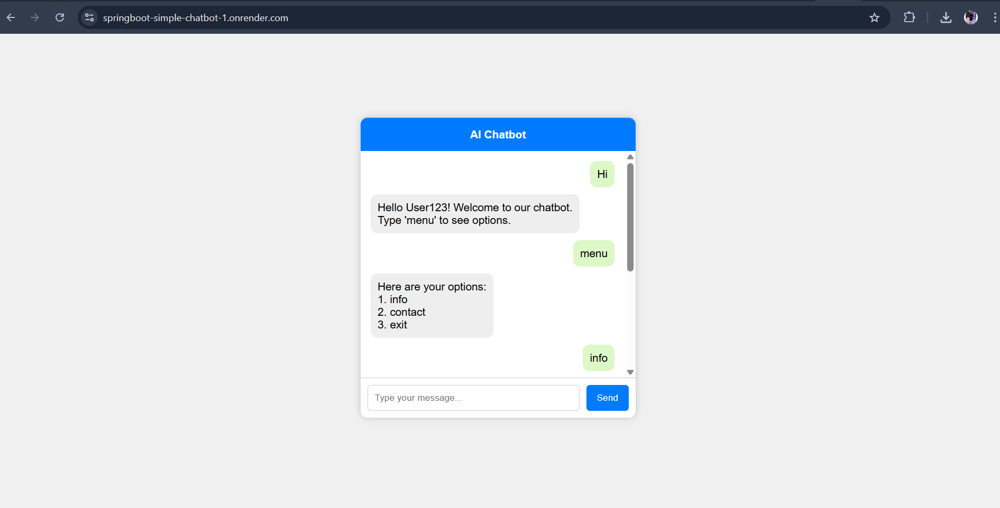
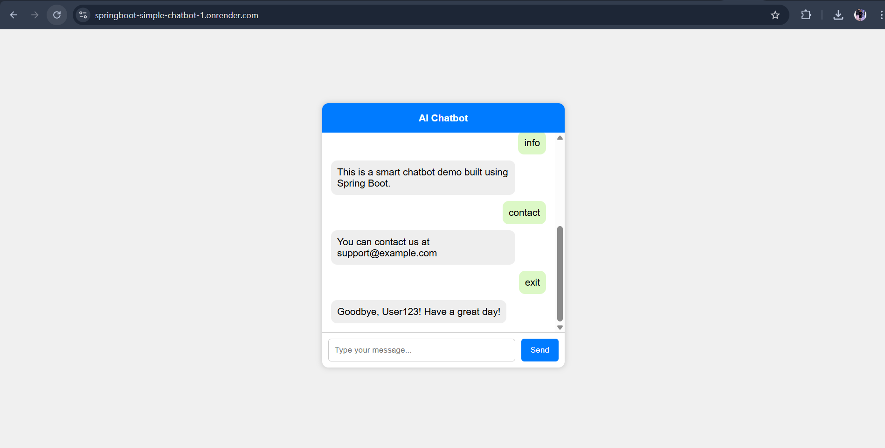

# 🤖 Spring Boot Chatbot Application

This is a backend chatbot application built using **Spring Boot**. It features REST APIs to handle user interaction and chatbot responses. The bot provides pre-defined replies and maintains conversation history. It also includes a basic UI and is deployed on Render.

### 🌐 Deployed URL
**Frontend/UI:** [https://springboot-simple-chatbot-1.onrender.com](https://springboot-simple-chatbot-1.onrender.com)

---

## 🚀 Features

- Built with Java and Spring Boot
- REST API communication with chatbot
- Message logging & history per user
- Simple HTML frontend for two-way interaction
- Ready for Firebase integration (optional)
- Deployed using Docker on Render

---

## 📬 API Endpoints – With Postman Usage

### 1️⃣ **Test API Endpoint**
- **Method:** `GET`
- **URL:** `/api/test`
- **Usage:**
```http
GET https://springboot-simple-chatbot-1.onrender.com/api/test
```
**Response:** `API is working!`  


---

### 2️⃣ **Send Message to Chatbot**
- **Method:** `POST`
- **URL:** `/api/send1`
- **Params:** `sender`, `message`
```http
POST https://localhost:8080/api/send1?sender=Ekta&message=Hello
```
```json
{
  "sender": "Ekta",
  "message": "Hello",
  "reply": "Hello ekta! Welcome to our chatbot. Type 'menu' to see options",
  "localDateTime": "2025-06-19T10:45:23.123456"
}
```


---

### 3️⃣ **Get All Messages**
- **Method:** `GET`
- **URL:** `/api/messages`
```http
GET https://springboot-simple-chatbot-1.onrender.com/api/messages
```
Returns full conversation log.  


---

### 4️⃣ **Get Chat History for a Sender**
- **Method:** `GET`
- **URL:** `/api/history`
- **Params:** `sender`
```http
GET https://springboot-simple-chatbot-1.onrender.com/api/history?sender=Ekta
```
Returns all messages for a specific user.  


---

## 🖼️ Chatbot UI Preview

HTML + JavaScript UI to chat with the backend bot.  
Place this file inside `src/main/resources/static/index.html`.




---

## 🔧 Tech Stack

- Java 21
- Spring Boot
- Maven
- Docker
- Render (for deployment)
- Firebase Firestore (optional, for chat storage)

---

## 🚀 How to Run Locally

1. Clone the repo
2. Run `mvn clean install`
3. Run main class: `ChatAppApplication`
4. Access: [http://localhost:8080](http://localhost:8080)

---

##  Author

**Jatin Ukey**  
[GitHub Repo](https://github.com/jatin-ukey21/springboot-simple-chatbot)

---
